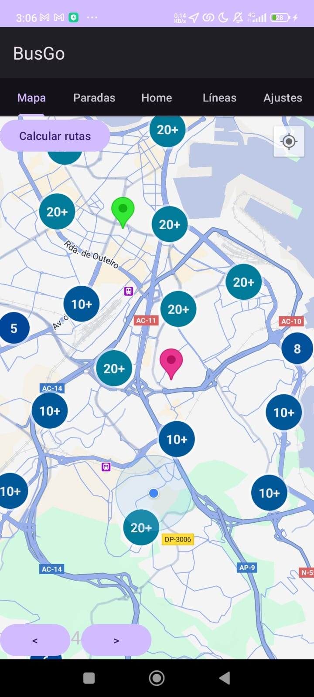
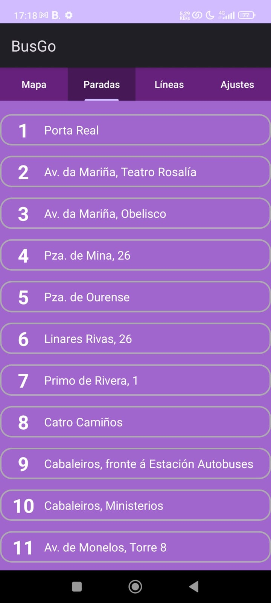
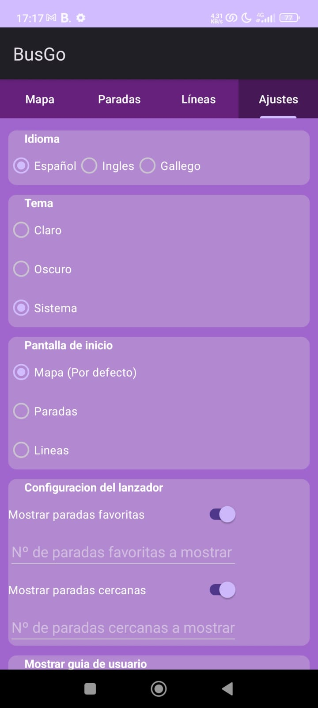

# AppBuses

Proyecto de desarollo de una aplicación de visualización y calculo de rutas de líneas y paradas de buses de A Coruña.

<p align="center">
  
</p>

## Objetivos ✨

Con esta aplicación buscamos optimizar la experiencia de los usuarios al utilizar el transporte público, proporcionando información precisa en tiempo real sobre rutas, horarios, paradas y disponibilidad de autobuses.

Por otra parte, ayuda a los usuarios a planificar sus desplazamientos de manera más eficiente y fomentar el uso del transporte público, teniendo un impacto positivo en el medio ambiente y en la calidad del aire.

## Características ⭐

- **Tab 'Mapa'** 🗺️ : Visualización y cálculo de rutas personalizadas.
- **Tab 'Paradas'** 🛑 : Lista de las paradas y detalle de cada parada.
- **Tab 'Lineas'** 🚏 : Listas de líneas y detalles de cada línea.
- **Tab 'Ajustes'** ⚙️ : Personalización y ajustes de la aplicación.

## Instalación 💻

Se puede instalar la aplicación directamente en cualquier dispositivo Android a través del APK proporcionada.

Por otra parte, si se quiere clonar el repositorio y ejecutarlo en local, se deben seguir los siguientes pasos:

1. Clonar el repositorio:
   ```bash
   git clone https://github.com/alvaroargibayp/BusGo.git

2. Ejecutar app en el emulador o dispositivo conectado indicado.

## Preview

<div style="display: flex; justify-content: space-between;">
  
  
  
  
</div>
